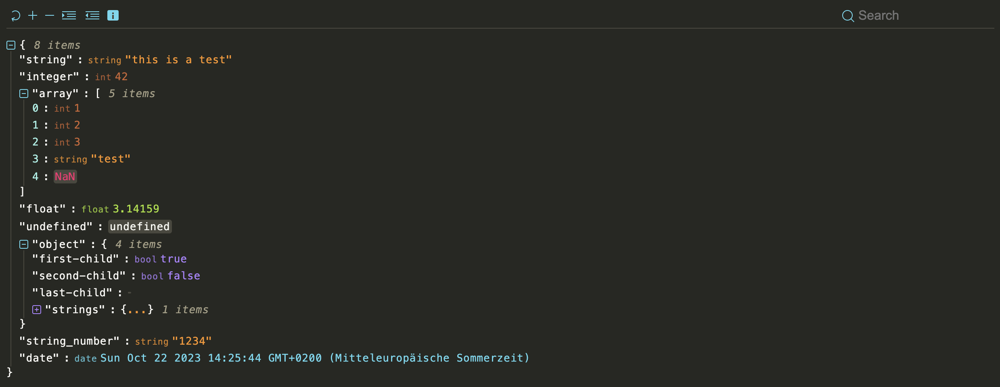

# json-viewer

 [](https://github.com/andypf/json-viewer/blob/main/LICENSE.md)  [](https://github.com/andypf/json-viewer/blob/main/LICENSE.md) 

**json-viewer** is a modern JavaScript-based JSON data visualization tool designed with cutting-edge web technologies, including Web Components and Shadow DOM. This versatile tool empowers you to elegantly and attractively present JSON data within your web browser. It's well-suited for use in standalone web applications and seamlessly integrates with popular frameworks like React.

The packed size of this project is approximately **32.3KB**.
Please note that half of this size is dedicated to the predefined themes, allowing for rich visual customization.




## Demo

For a live demonstration of **json-viewer**, please visit our [demo](https://pfau-software.de/json-viewer/demo/).

## Inspired by react-json-view

**json-viewer** is inspired by the functionality and user-friendliness of [react-json-view](https://github.com/mac-s-g/react-json-view). However, our mission was to make this feature-rich visualization tool accessible beyond the confines of React. We've taken the best ideas from react-json-view and implemented them in **json-viewer** to cater to a broader audience.

## Features

- Stylish visualization of JSON data.
- Supports usage in the browser and within React applications.
- Utilizes modern web technologies like Web Components and Shadow DOM.
- Easy integration into existing projects.
- Customizable presentation and configuration.

## Installation

### npm

You can easily install the **json-viewer** package using npm with the following commands:

```bash
npm install @andypf/json-viewer
```

Next, include it in your project:

```javascript
import "@andypf/json-viewer"
```

Now, you're ready to use it as a custom HTML tag within your web application:

```html
<andypf-json-viewer data='{"test": "Hello World"}'></andypf-json-viewer>
```

### Browser Integration

To use **json-viewer** in your web application, load json-viewer.js and embed your JSON object within an HTML element of your choice and initialize **json-viewer** as follows:

```html
<!doctype html>
<html>
  <head>
    <script src="https://pfau-software.de/json-viewer/dist/iife/index.js"></script>
  </head>
  <body>
    <andypf-json-viewer>{"name": "Helmut"}</andypf-json-viewer>
  </body>
</html>
```

## Usage

### As an HTML Element

To include the "json-viewer" element in your HTML, you can pass options as attributes:

```html
<andypf-json-viewer
  indent="2"
  expanded="true"
  theme="default-light"
  show-data-types="true"
  show-toolbar="false"
  expand-icon-type="arrow"
  show-copy="true"
  show-size="true"
  data='{"example": "data"}'
></andypf-json-viewer>
```

You can also provide the `data` option as the content of the "json-viewer" element:

```html
<andypf-json-viewer
  indent="2"
  expanded="true"
  theme="default-light"
  show-data-types="true"
  show-toolbar="false"
  expand-icon-type="square"
  show-copy="true"
  show-size="true"
>
  { "string": "this is a test ...", "integer": 42, "array":[ 1, 2, 3, "test", "NaN"], "float":3.14159,
  "string_number":"1234", "date": "Tue, Oct 17, 2023, 08:58 AM" }
</andypf-json-viewer>
```

You can also provide a URL to a JSON file as the 'data':

```html
<andypf-json-viewer
  data="https://microsoftedge.github.io/Demos/json-dummy-data/64KB.json"
  theme="monokai"
  expanded="2"
  show-toolbar="true"
></andypf-json-viewer>
```

### Using JavaScript API

If you prefer JavaScript, you can set the options programmatically:

```javascript
const jsonViewer = document.createElement("andypf-json-viewer")
jsonViewer.id = "json"
jsonViewer.expanded = 2
jsonViewer.indent = 2
jsonViewer.showDataTypes = true
jsonViewer.theme = "monokai"
jsonViewer.showToolbar = true
jsonViewer.showSize = true
jsonViewer.showCopy = true
jsonViewer.expandIconType = "square"
jsonViewer.data = { example: "data" }
```

### Integration with React

**json-viewer** can also be used as a React component in your React applications.

```js
import React from "react"
import JsonViewer from "@andypf/json-viewer/dist/esm/react/JsonViewer"

// use the component in your app!
const MyComponent = () => <JsonViewer data={jsonObject} />
```

Or if you prefer a more customized approach:

```js
import React from "react"
import "@andypf/json-viewer"

const JsonViewer = ({ data, ...props }) => {
  const ref = React.useRef(null)

  React.useEffect(() => {
    if (ref.current) {
      ref.current.data = data
    }
  }, [data])
  return <andypf-json-viewer ref={ref} {...props} />
}

export default JsonViewer
```

## Options

| Option                                | Type                           | Default Value   | Description                                                                                                                                                                           |
| ------------------------------------- | ------------------------------ | --------------- | ------------------------------------------------------------------------------------------------------------------------------------------------------------------------------------- |
| `indent`                              | Number                         | 2               | The number of spaces used for indentation when rendering the JSON data.                                                                                                               |
| `expanded`                            | Number or Boolean              | 2               | The initial depth to which the JSON data is expanded. You can also set it to `true` to fully expand the data, or `false` to collapse it.                                              |
| `theme`                               | String or JSON Object          | "default-light" | The theme used for styling the JSON viewer. You can provide a JSON object with custom CSS variables. There are many [predefined themes](#themes)                                      |
| `showDataTypes` (`show-data-types`)   | Boolean                        | true            | Whether to display data types (e.g., "string", "number") alongside the values.                                                                                                        |
| `showToolbar` (`show-toolbar`)        | Boolean                        | false           | Whether to display the toolbar with expand and indent options and a searchbar.                                                                                                        |
| `expandIconType` (`expand-icon-type`) | String                         | "square"        | The type of icons used for expanding and collapsing JSON nodes. You can choose "square", "circle" or "arrow".                                                                         |
| `showCopy` (`show-copy`)              | Boolean                        | true            | Whether to show the copy button to copy the JSON data to the clipboard.                                                                                                               |
| `showSize` (`show-size`)              | Boolean                        | true            | Whether to display the size (number of characters) of the JSON data.                                                                                                                  |
| `data`                                | Stringified JSON or URL String | (Not specified) | The JSON data to be visualized. You can provide it as a stringified JSON or a URL string. Alternatively, you can pass the data via the API as an object or as content within the tag. |

## Toolbar Functions

If the toolbar is enabled, users have access to the following functions:

- Reset: Restore the original view.
- Expand: Expand all levels by one (+1).
- Collapse: Collapse all levels by one (-1).
- Indent: Increase the indentation level by one (+1).
- Indent: Decrease the indentation level by one (-1).
- Search: Search for specific elements within the JSON.

## Themes

The "theme" option allows you to choose from various themes:

- apathyashes
- atelier-dune-light
- atelier-dune
- atlas
- bespin
- black-metal
- brewer
- bright
- brogrammer
- brushtrees-dark
- brushtrees
- chalk
- circus
- classic-dark
- classic-light
- codeschool
- cupcake
- cupertino
- darcula
- darktooth
- default-dark
- default-light
- dracula
- eighties
- embers
- flat
- fruit-soda
- github
- google-dark
- google-light
- grayscale-dark
- grayscale-light
- greenscreen
- gruvbox-dark-hard
- gruvbox-light-hard
- harmonic-dark
- harmonic-light
- heetch-light
- heetch
- helios
- hopscotch
- horizon-dark
- ia-dark
- ia-light
- icy
- isotope
- macintosh
- marrakesh
- materia
- material-lighter
- material
- mellow-purple
- mexico-light
- mocha
- monokai
- nord
- ocean
- one-light
- onedark
- papercolor-dark
- papercolor-light
- paraiso
- pico
- pop
- railscasts
- seti
- solarized-dark
- solarized-light
- spacemacs
- summerfruit-dark
- summerfruit-light
- tomorrow-night
- tomorrow
- tube
- twilight
- woodland
- zenburn

### Customizations

### Custom Theme Customization

Tailor the visual theme to your preferences by crafting a JSON object with the following properties, based on the 16 fundamental colors outlined in the [Base16 styling](https://github.com/chriskempson/base16/blob/main/styling.md). Please note that not all colors are employed in this project:

- `base00`: Default Background
- `base01` (**unused**): Lighter Background (Reserved for status bars, line numbers, and folding marks)
- `base02`: Borders and Background for types NaN, null, and undefined
- `base03` (**unused**): Comments, Invisibles, Line Highlighting
- `base04`: Item Size
- `base05`: Default Foreground, Brackets, and Colons
- `base06` (**unused**): Light Foreground (Infrequently used)
- `base07`: Keys, Colons, and Brackets
- `base08`: Color for NaN
- `base09`: Ellipsis and String Values
- `base0A`: Regular Expressions and Null Values
- `base0B`: Floating-Point Values
- `base0C`: Number Keys
- `base0D`: Icons, Search Input, Date
- `base0E`: Booleans and Expanded Icons
- `base0F`: Integers

This versatile approach empowers you to create a tailored theme that aligns with your specific UI element requirements, giving you the freedom to fine-tune the visual experience of your JSON viewer.

Example:

```html
<andypf-json-viewer
  indent="2"
  expanded="true"
  show-data-types="true"
  show-toolbar="false"
  expand-icon-type="arrow"
  show-copy="true"
  show-size="true"
  theme='{"base00": "gray", "base01": "blue", "base02": "yellow", "base03": "orange", "base04": "red", "base05": "#9DA0A2", "base06": "#D2D5D7", "base07": "#F1F2F3", "base08": "#EF5253", "base09": "#E66B2B", "base0A": "#E4B51C", "base0B": "#7CC844", "base0C": "#52CBB0", "base0D": "#33A3DC", "base0E": "#A363D5", "base0F": "gray"}'
>
  {"string": "this is a test ...", "integer": 42, "array":[ 1, 2, 3, "test", "NaN"], "float":3.14159,
  "string_number":"1234", "date": "Tue, Oct 17, 2023, 08:58 AM"}
</andypf-json-viewer>
```

## License

This project is licensed under the MIT License - see the [LICENSE](LICENSE.md) file for details.
